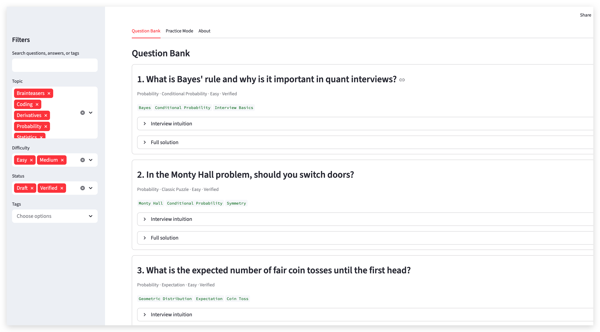
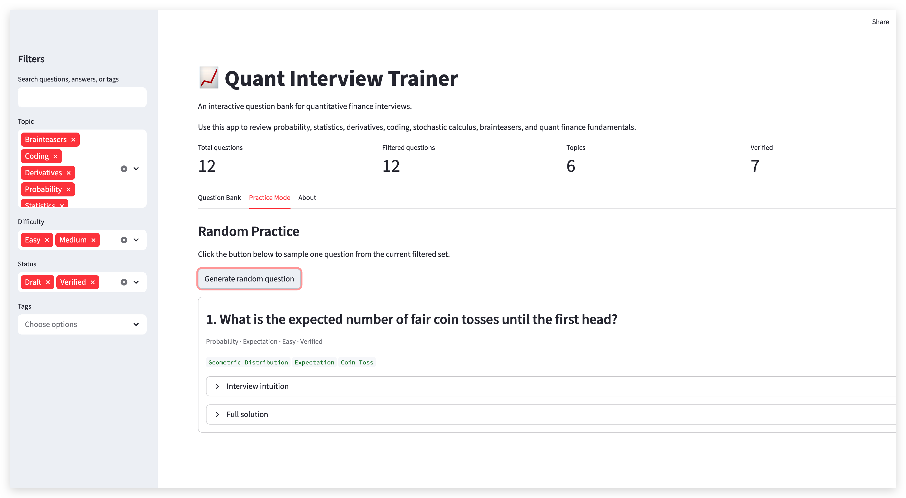

# Quant Finance Interview Notes

This repository contains my personal Quant Finance interview preparation notes.

The notes cover probability, statistics, derivatives pricing, Greeks, stochastic calculus, numerical methods, coding, and mock interview questions. The project is currently under active development.

## Interactive Quant Interview Trainer

I also built an interactive Streamlit app based on these quant interview notes.

The app includes:

- searchable question bank
- topic and difficulty filters
- expandable interview intuition and full solutions
- random practice mode
- JSON-based question storage

[Launch the Streamlit App](https://quant-interview-trainer.streamlit.app/)

### Screenshots

#### Home / Question Bank

#### Question Bank

#### Practice Mode

## Current Progress

### Completed Drafts

- Black-Scholes-Merton derivations
  - Risk-neutral/martingale pricing derivation
  - Delta-hedging PDE derivation
  - Replication portfolio derivation

### Planned Sections

- Greeks and hedging
- Binomial and trinomial models
- Monte Carlo pricing
- Stochastic calculus
- Heston, Bates, and local volatility models
- Probability and statistics interview questions
- Python/C++ coding interview preparation

## Purpose

The purpose of this project is to build a structured and rigorous set of notes for Quant Finance interviews, combining mathematical derivations, intuition, implementation ideas, and practical interview-style explanations.

## Disclaimer

These are personal study notes. They are not copied from any copyrighted interview book or official source.
