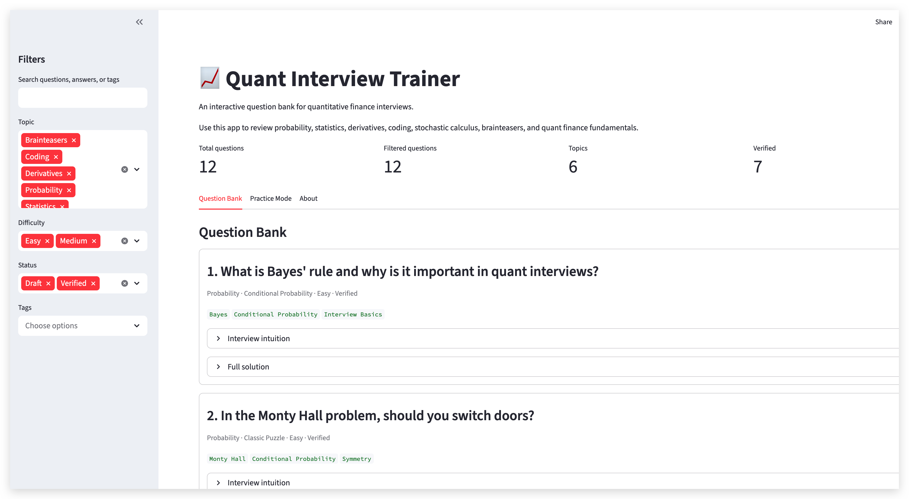

# Quant Finance Interview Notes

This repository contains my personal **Quant Finance interview preparation notes** and an interactive **Streamlit-based Quant Interview Trainer**.

The project combines static study notes with an active-recall app for reviewing quantitative finance concepts, practising interview questions, revising formulas, and working through coding exercises.

---

## Interactive Quant Interview Trainer

I built an interactive Streamlit app based on these quant interview notes.

The app is designed to turn static notes into a structured interview-preparation platform with:

- searchable question bank
- topic and subtopic navigation
- scoped search and sorting controls
- random practice mode
- quiz mode with self-assessment
- preset mock interview tracks
- dedicated coding exercise mode
- formula revision mode
- performance analytics dashboard
- review mode for weak questions
- formula sheet / quick reference
- content quality dashboard
- curation workspace
- content workflow for future updates
- JSON-based question and formula storage

[Launch the Streamlit App](https://quant-interview-trainer.streamlit.app/)

---

## Current App Snapshot

| Item | Count |
|---|---:|
| Questions | 301 |
| Formulas | 72 |
| Questions with code examples | 82 |
| Main topics | 9 |
| Verified questions | 264 |

---

## Topic Coverage

The current question bank covers:

- Probability
- Brainteasers
- Statistics
- Time Series
- Machine Learning
- Derivatives
- Greeks
- Stochastic Calculus
- Coding and Quant Developer topics

---

## Main App Features

### Learning and Review

The app supports structured revision through:

- **Question Bank** for searchable interview questions
- **Topics** tab for topic and subtopic navigation
- **Formulas** tab for quick formula reference
- **Formula Quiz** for active formula recall
- **Review** mode for weak questions

### Practice and Interview Simulation

The app includes several active practice modes:

- **Practice** mode for random question review
- **Quiz** mode with hidden answers and self-assessment
- **Mock** interview mode with preset tracks
- **Coding** mode for coding-interview style exercises
- **Analytics** tab for session-level performance summaries

### Content Management

The app also includes tools for maintaining and expanding the question bank:

- **Quality** dashboard for checking missing fields, duplicate IDs, and content structure
- **Curation** workspace for manual review
- **Workflow** tab for long-term content update guidance
- **Status** tab summarising the framework and next steps

---

## Mock Interview Tracks

The app currently includes preset mock interview tracks such as:

- Quant Researcher
- Quant Developer
- Derivatives Pricing
- Probability & Brainteasers
- Statistics & Machine Learning

These tracks sample questions using topic-specific weights and use the same hidden-answer and self-assessment workflow as the quiz mode.

---

## Coding Exercise Mode

The coding section includes public-safe coding exercises in:

- Python
- pandas
- NumPy
- algorithms
- numerical methods
- C++
- market-data style problems
- portfolio analytics
- simple backtesting logic

Example coding topics include:

- simple and log returns
- rolling Sharpe ratio
- maximum drawdown
- OHLCV resampling
- bid-ask spread and mid price
- trade-to-quote `merge_asof`
- bisection and Newton root finding
- Monte Carlo option pricing
- prefix sums and sliding windows
- C++ memory and RAII concepts

---

## Screenshots

After each major UI update, screenshots should be refreshed in:

```text
docs/screenshots/
```

Recommended screenshot names:

```text
home.png
topics.png
questions.png
quiz.png
mock.png
coding.png
formula_quiz.png
analytics.png
quality.png
curation.png
workflow.png
status.png
```

Example screenshot links:




---

## Quant Interview Notes PDF

The repository also contains my compiled interview notes PDF:

```text
Quant_Interview.pdf
```

Current completed draft:

- Black-Scholes-Merton derivations
  - risk-neutral / martingale pricing derivation
  - delta-hedging PDE derivation
  - replication portfolio derivation

Planned note sections include:

- Greeks and hedging
- binomial and trinomial models
- Monte Carlo pricing
- stochastic calculus
- Heston, Bates, and local volatility models
- probability and statistics interview questions
- Python / C++ coding interview preparation

---

## Project Structure

A typical structure is:

```text
.
├── app.py
├── README.md
├── requirements.txt
├── Quant_Interview.pdf
├── config/
│   └── app_config.json
├── data/
│   ├── questions.json
│   └── formulas.json
└── docs/
    ├── screenshots/
    ├── templates/
    ├── presentation/
    └── version-notes/
```

---

## Run Locally

Install dependencies:

```bash
pip install -r requirements.txt
```

Run the Streamlit app:

```bash
streamlit run app.py
```

---

## Content Update Workflow

The long-term workflow is:

```text
Add content
→ validate in Quality dashboard
→ inspect in Curation workspace
→ mark stable items as Verified
→ commit and push
→ redeploy app
```

Public-safe interview content should be stored in:

```text
data/questions.json
data/formulas.json
```

Private or research-sensitive drafts should stay outside the public repository, for example:

```text
private/
```

---

## Roadmap

The main app framework is now close to complete.

Planned next steps:

```text
v1.21A  Screenshot refresh and deployment check
v1.22A  Optional small bug-fix / stabilization release
v2.0    Optional persistent progress tracking
```

Future content expansion can focus on:

- more public-safe probability questions
- more derivatives and Greeks questions
- more coding exercises
- more mock interview tracks
- better formula coverage

---

## Purpose

The purpose of this project is to build a structured and rigorous set of resources for Quant Finance interviews, combining:

- mathematical derivations
- intuition
- implementation ideas
- coding exercises
- practical interview-style explanations
- active recall and mock interview practice

This repository is also part of my public portfolio, showing my interest in quantitative finance, programming, derivatives, numerical methods, and structured learning tools.

---

## Disclaimer

These are personal study notes and self-built interview preparation materials. They are not copied from any copyrighted interview book or official source.
